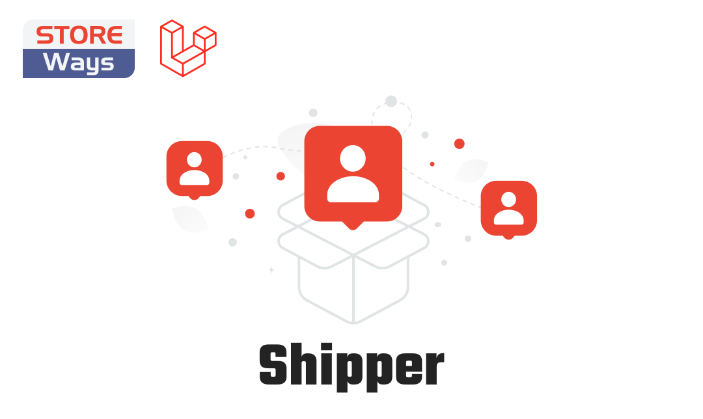

  
  

# StoreWays Shipper

The module manages countries and cities, the cost of shipping for each region, and the integration of shipping methods

## Documentation

You can find the detailed documentation here in [SOON](#).

## Contributing

Thank you for considering contributing to this package! Be one of the Store team.

## License

This package is an open-sourced software licensed under the [MIT license](https://opensource.org/licenses/MIT).
